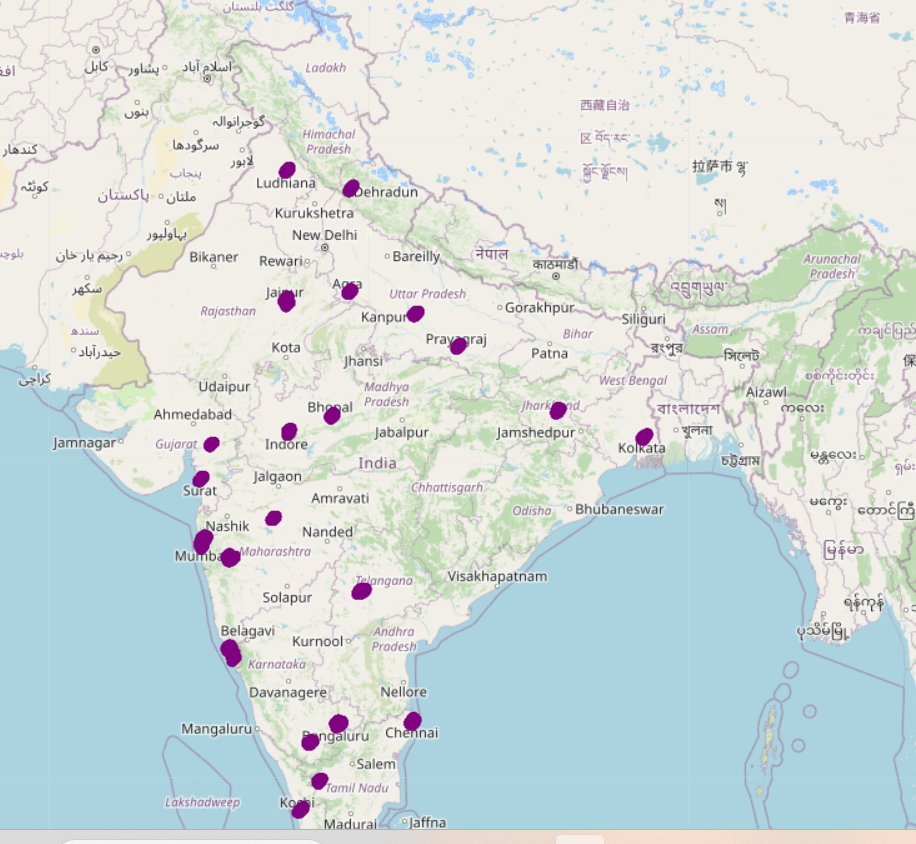

# Datasets Folder

This folder contains the dataset used for training and evaluating the delivery time prediction model.

The data is based on real-world Swiggy delivery records and includes features such as order details, traffic conditions, weather, vehicle info, and more — all of which help in accurately predicting delivery times.

## Cities Data Visualization

Below is a visualization of the geographic distribution of the data:

