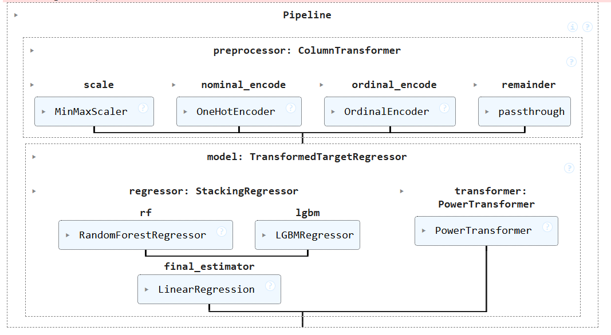
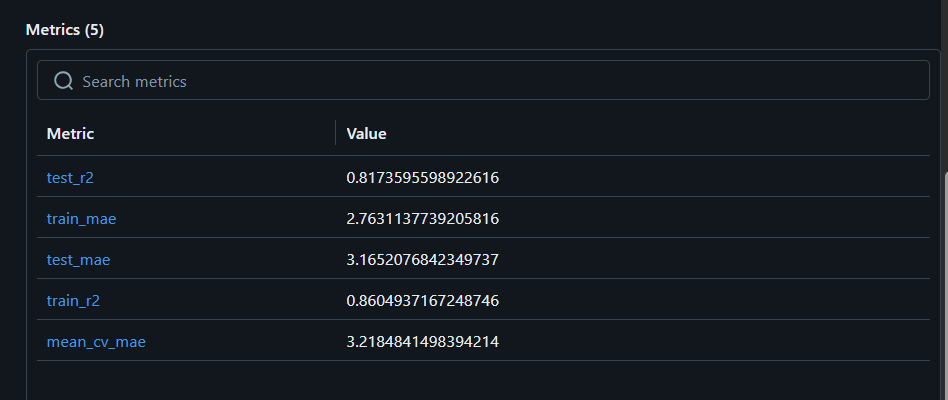

# 🤖 Models Directory

This directory contains trained machine learning models, serialized artifacts, and related documentation for the Swiggy delivery time prediction system.

## 📁 Directory Structure

### Recommended File Organization

- `model.pkl`: Final production-ready trained model
- `baseline_model.pkl`: Initial baseline model for comparison
- `model_experiments/`: Directory for storing different model versions and experiments
- `*.ipynb`: Jupyter notebooks for model development and evaluation

## 🔄 Model Development Pipeline

Our machine learning pipeline follows these key stages:

1. **Data Preprocessing**: Feature engineering and data cleaning
2. **Model Selection**: Comparing multiple algorithms (Random Forest, LightGBM, XGBoost)
3. **Hyperparameter Tuning**: Optimization using Optuna
4. **Model Ensemble**: Stacking multiple models for better performance
5. **Validation**: Cross-validation and performance evaluation
6. **Deployment**: Model serialization and integration

### 🔄 Pipeline Visualization


## 📊 Model Performance Metrics

Our ensemble approach combines the strengths of multiple algorithms:

- **Base Models**: 
  - Random Forest Regressor
  - LightGBM Regressor  
  - XGBoost Regressor
- **Meta-Model**: Stacking Regressor
- **Optimization**: Optuna hyperparameter tuning
- **Validation Strategy**: Time-based cross-validation

### 📊 Performance Results


## 🚀 Model Usage

### Loading the Model
```python
import pickle
import joblib

# Load the trained model
with open('model.pkl', 'rb') as f:
    model = pickle.load(f)

# Make predictions
predictions = model.predict(X_test)
```

### Model Input Features
The model expects 19 features in the following order:
1. `type_of_order` - Type of food order
2. `order_time_of_day` - Time when order was placed
3. `distance` - Delivery distance
4. `ratings` - Restaurant/delivery ratings
5. `weather` - Weather conditions
6. `traffic` - Traffic density
7. `festival` - Festival period indicator
8. `city_type` - Urban/suburban classification
9. `is_weekend` - Weekend indicator
10. `type_of_vehicle` - Delivery vehicle type
11. `vehicle_condition` - Vehicle condition status
12. `multiple_deliveries` - Multiple delivery indicator
13. `pickup_time` - Food pickup time

## 📈 Model Evaluation

### Performance Metrics
- **MAE (Mean Absolute Error)**: [Add actual value]
- **RMSE (Root Mean Square Error)**: [Add actual value]
- **R² Score**: [Add actual value]
- **MAPE (Mean Absolute Percentage Error)**: [Add actual value]

### Cross-Validation Results
- **CV Mean Score**: [Add actual value]
- **CV Standard Deviation**: [Add actual value]

## 🔧 Hyperparameter Optimization

We use Optuna for systematic hyperparameter tuning:

```python
import optuna

def objective(trial):
    # Define hyperparameter search space
    params = {
        'n_estimators': trial.suggest_int('n_estimators', 50, 300),
        'max_depth': trial.suggest_int('max_depth', 3, 15),
        'learning_rate': trial.suggest_float('learning_rate', 0.01, 0.3)
    }
    # Model training and evaluation
    return score

study = optuna.create_study(direction='minimize')
study.optimize(objective, n_trials=100)
```

## 🔗 External Resources

- 📊 [MLflow Dashboard](https://dagshub.com/vkyadav7635/Swiggy-Delivery-Time-Prediction.mlflow) - Experiment tracking
- 🗂️ [Google Drive Artifacts](https://drive.google.com/drive/folders/1amTEFs91NO_icdShALPP7RNdAg5ZMk35) - Model files and data
- 📚 [Model Development Notebooks](.) - Jupyter notebooks in this directory

## 🔄 Model Versioning

| Version | Date | Description | Performance |
|---------|------|-------------|-------------|
| v1.0 | [Date] | Baseline Random Forest | [Metrics] |
| v2.0 | [Date] | LightGBM + Hypertuning | [Metrics] |
| v3.0 | [Date] | Ensemble Stacking | [Metrics] |

## 🤝 Contributing to Models

When adding new models or improvements:

1. Follow the naming convention: `model_version_description.pkl`
2. Update this README with model details
3. Include performance metrics and comparison
4. Document any new dependencies or requirements
5. Ensure reproducibility with random seeds

---

For questions about model implementation or performance, please refer to the notebooks in this directory or create an issue in the main repository.
