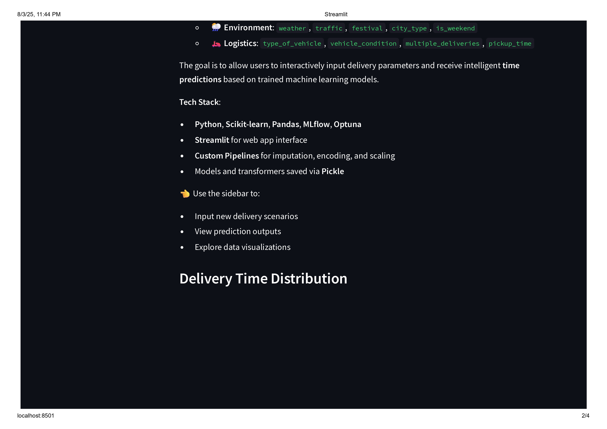
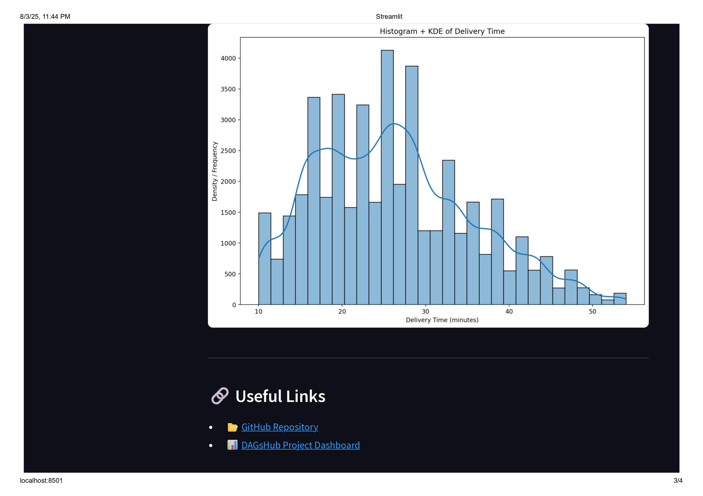
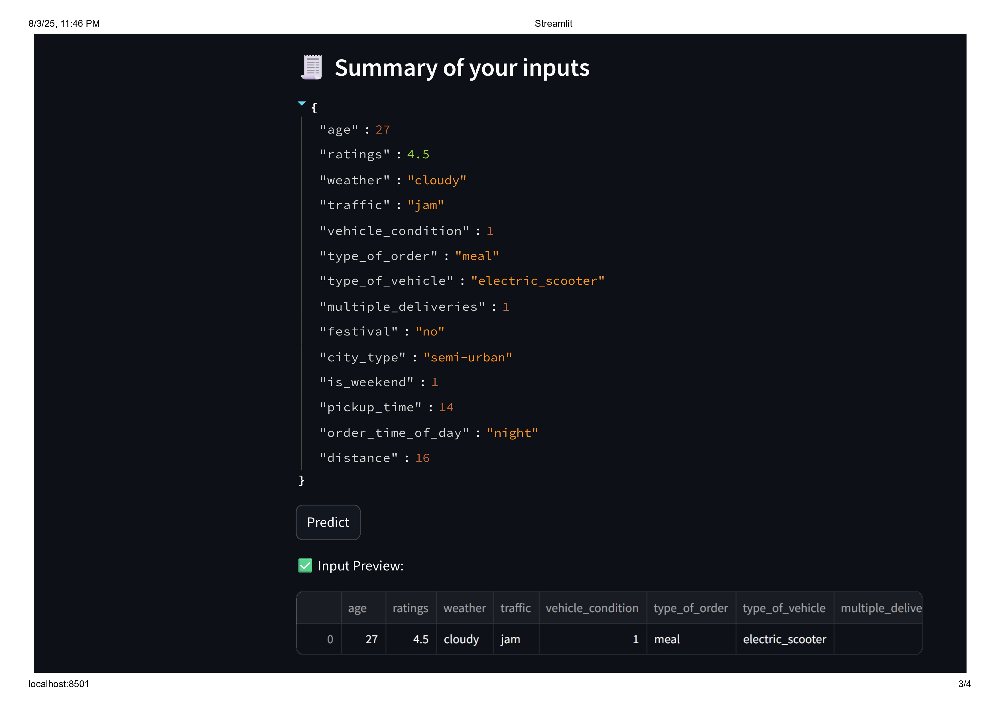

# Streamlit Web Application

Welcome to the **Delivery Time Prediction App** — an intelligent web application built to optimize last-mile food delivery by providing accurate delivery time estimates. This Streamlit-powered interface makes machine learning predictions accessible through an intuitive web interface.

## Application Overview

This web application leverages real Swiggy delivery data and advanced machine learning models to provide accurate delivery time predictions. The app features a clean, user-friendly interface that allows users to input delivery parameters and receive instant predictions.

## Getting Started

### Prerequisites
- Python 3.8 or higher
- pip package manager

### Installation

1. **Navigate to the app directory**:
   ```bash
   cd streamlit_app
   ```

2. **Create a virtual environment** (recommended):
   ```bash
   python -m venv venv
   source venv/bin/activate  # On Windows: venv\Scripts\activate
   ```

3. **Install dependencies**:
   ```bash
   pip install -r requirements.txt
   ```

### 🏃‍♂️ Running the Application

1. **Start the Streamlit server**:
   ```bash
   streamlit run app.py
   ```

2. **Access the application**:
   - Open your web browser
   - Navigate to `http://localhost:8501`
   - The application will load automatically

3. **Alternative port** (if 8501 is busy):
   ```bash
   streamlit run app.py --server.port 8502
   ```

## 🖥️ Application Structure

### File Organization
```
streamlit_app/
├── app.py                    # Main application entry point
├── Home.py                   # Home page component
├── Time_prediction.py        # Prediction interface
├── requirements.txt          # Python dependencies
├── swiggy_imputed_data.pkl   # Preprocessed data for reference
└── readme.md                 # This documentation
```

## Application Screenshots

Here are some screenshots of the Streamlit web application in action:

### Home Page





### Prediction Interface




